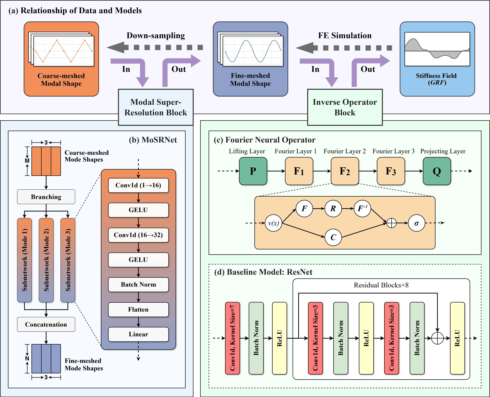
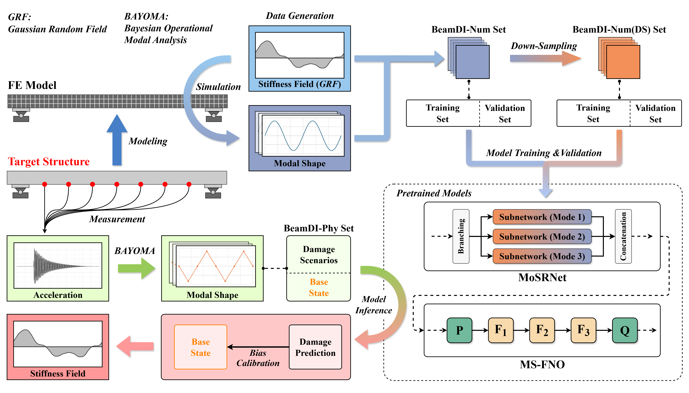
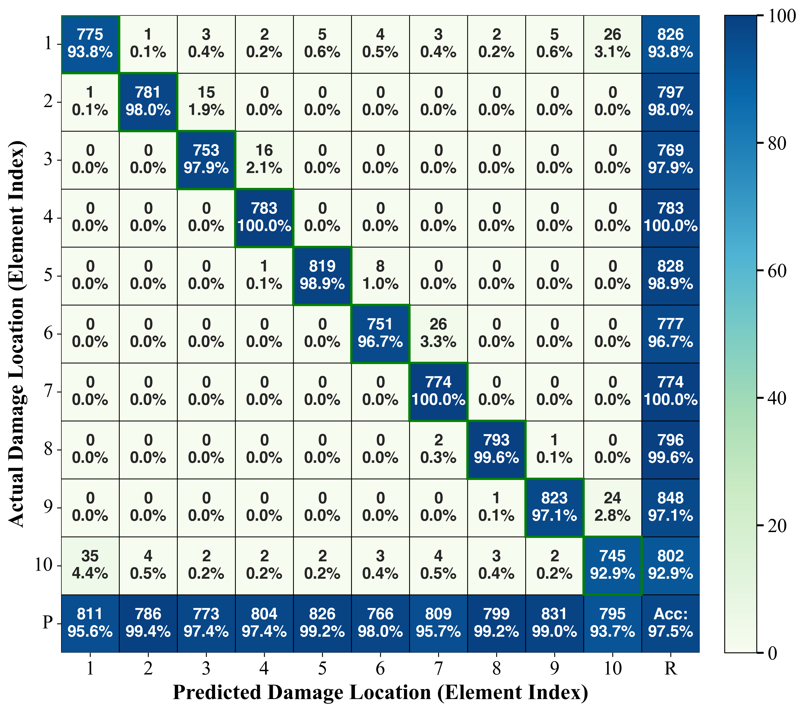

# MoSRNet + MS-FNO: High-Resolution Damage Identification

Lightweight Modal Super-Resolution CNN and Fourier Neural Operator for High-Resolution Damage Identification  
Manuscript: `20251107 manuscript for AIC_v2.docx`

## Overview
This repository implements a synergistic framework for high-resolution damage identification in bridge structures:
1) **MoSRNet** reconstructs fine-meshed mode shapes from sparse measurements.  
2) **MS-FNO** learns an operator mapping from modal responses to stiffness fields.  
3) **ResNet** is used as the baseline for comparison.

Key points (aligned with the manuscript and code):
- Only the first three mode shapes and sparse sensors are used.
- Training data are generated with 1D Gaussian Random Fields (GRF) to model continuous stiffness loss.
- Numerical and experimental validations show stronger accuracy and stability than ResNet.

## Figures (from the manuscript)
Place the manuscript figures in `docs/figs/` with the names below so they render in this README.

### Framework and workflow



### Experimental setup


## Results gallery (generated)





Additional results are under `results/postprocessed`:
- Training curves: `results/postprocessed/C3S4/fig`
- Numerical validation: `results/postprocessed/C4S1/fig`, `results/postprocessed/C4S2/fig`, `results/postprocessed/C4S2/csv`
- OOD / MCS: `results/postprocessed/C4S3/fig`, `results/postprocessed/C4S3/csv`
- Experimental validation: `results/postprocessed/C5S2/fig`, `results/postprocessed/C5S3/fig`

## Data and setup (paper-aligned)
Numerical data are generated with an Euler-Bernoulli beam FE model (540 elements / 541 nodes). Key parameters:
- Length = 5.4 m
- E = 2.1e11 N/m^2
- I = 5.709e-7 m^4
- rho = 7850 kg/m^3
- A = 6.542e-3 m^2

Datasets under `datasets/`:
- **BeamDI-Num**: 9000 numerical samples (8000 train / 1000 val) for MS-FNO and ResNet.
- **BeamDI-Num(DS)**: down-sampled mode shapes at 9 points for MoSRNet.
- **BeamDI-Phy**: experimental mode shapes (7 accelerometers + BAYOMA).

## Repository structure
- `models/`: MoSRNet, MS-FNO, ResNet definitions
- `experiments/`: training loops and metrics
- `configs/`: training configs (paper hyperparameters)
- `datasets/`: numerical and experimental `.pt` data
- `results/`: checkpoints and postprocessed outputs
- `postprocess_*.py`: figures and metrics for the manuscript
- `run_train_*.py`, `unified_training_manager.py`: training entry points

## Quick start
Install dependencies:
```bash
pip install -r requirements.txt
```

Train models (reads `configs/`):
```bash
py run_train_mosrnet.py
py run_train_msfno.py
py run_train_resnet.py
```

Batch training (interactive or CLI):
```bash
py unified_training_manager.py
# or: py unified_training_manager.py --scripts all --configs-all all --wandb 0
```

OOD / Monte Carlo Simulation:
```bash
py run_mcs.py
```
Output: `results/mcs_test/msc_maxpos_rawidx.csv`

Postprocess figures and metrics:
```bash
py postprocess_c3s4_fig.py
py postprocess_c4s1_fig.py
py postprocess_c4s2_csv.py
py postprocess_c4s2_fig.py
py postprocess_c4s3_fig.py
py postprocess_c5s2_fig.py
py postprocess_c5s3_fig.py
```

## Experimental setup (summary)
The lab beam is a simply supported steel beam (5.4 m). Two damage types are used:
- **DMG1**: multiple cuts on the left side (MCUT)
- **DMG2**: wedge cut on the right side (WEDG)

By adding or removing reinforcement plates, four scenarios are created: MCUT, WEDG, WCUT, and REIN.  
REIN is used as the base state for bias calibration. Mode shapes are identified from 7 accelerometers.

## Limitations and outlook
- Sensitivity to minor damage (below ~15% stiffness loss) is limited.
- Future work includes frequency features, multi-source data fusion, and varied boundary conditions.

## Citation
If you use this project, please cite the manuscript in this repository:  
`20251107 manuscript for AIC_v2.docx`
